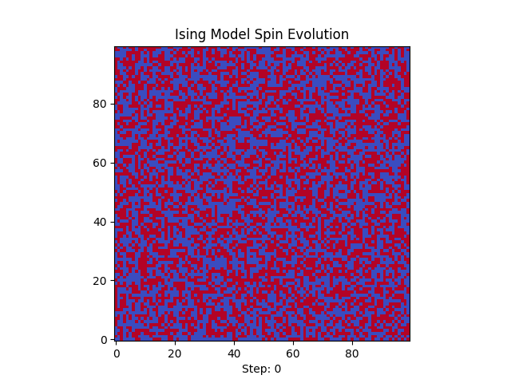

# 🧲 IsingModel

This repository is a study repository for one of the most well-known statistical mechanics and electromagnetism models, the Ising-Lenz spin lattice, named after the German physicists Wilhelm Lenz and Ernst Ising[[1]](#1). <br>
The model abstracts a ferromagnetic solid with an array of magnetic spins under the influence of an external magnetic field, with the goal to model some solid's magnetization after being exposed to an external field.


## Features

- Simple usage, generate your simulations with data output and GIF of the spin's evolution easily;
- OOP writing, simple maintenance and developing.

---

## Structure

### Classes

- ``IsingMetal``: the main and only class in the module. Simulates the Ising model. The majority of its methods are private for clarity of use.

---

## Setup

The requirements are only ``numpy`` and ``matplotlib``, avaiable via ``pip``.

```bash
pip install git+https://github.com/OffworldAstronaut/IsingModel.git
```

## Usage

It's a plug-and-play collection of classes. Download and import. 

```py
# example.py

# Imports
from Ising import IsingMetal

# parameters
coupling = 1.0
temp = 1.0
ext_field = 0.0
dim = (100, 100)

# Creates the model 
metal = IsingMetal(dim=dim, coupling=coupling, temp=temp, ext_field=ext_field)
# Runs it
metal.run_simulation(100_000)
```

### Generated .gif



## To-do

- General data collection and plotting;
- Asymptotic data collection;

## References
<a id="1">[1]</a> 
Ising, E.;
*Beitrag zur Theorie des Ferromagnetismus (Contribution to the theory of ferromagnetism)* (1925)